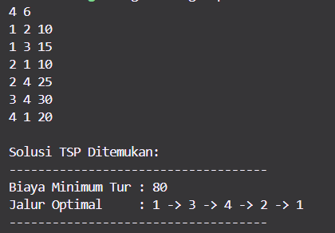

# Solusi Traveling Salesman Problem (TSP) dengan Dynamic Programming

Tugas ini menyediakan implementasi untuk menyelesaikan Traveling Salesman Problem (TSP) menggunakan algoritma Held-Karp, sebuah pendekatan pemrograman dinamis dengan bitmask.

## Deskripsi Masalah TSP

Traveling Salesman Problem adalah masalah optimasi klasik di mana seorang salesman harus mengunjungi sejumlah kota (masing-masing tepat satu kali) dan kembali ke kota awal, dengan tujuan meminimalkan total jarak atau biaya perjalanan.

## Pendekatan Algoritma (Held-Karp)

1.  **State DP:** `dp[mask][i]` menyimpan biaya minimum untuk mengunjungi semua kota yang direpresentasikan dalam `mask` (sebuah bitmask integer, di mana bit ke-`j` diset jika kota `j` telah dikunjungi), dengan perjalanan berakhir di kota `i`.
2.  **Parent Tracking:** `parent[mask][i]` menyimpan kota sebelumnya yang dikunjungi untuk mencapai state `(mask, i)` dengan biaya optimal, yang digunakan untuk merekonstruksi jalur.
3.  **Inisialisasi:** `dp[1 << start_node][start_node] = 0`.
4.  **Iterasi:** Program mengiterasi melalui semua kemungkinan subset kota (`mask`) dan kota terakhir (`u` dalam `mask`), kemudian mencoba memperluas jalur ke kota berikutnya (`v` yang belum ada di `mask`). Jika jalur yang lebih pendek ditemukan, `dp[new_mask][v]` dan `parent[new_mask][v]` diperbarui.
5.  **Solusi Akhir:** Biaya minimum tur ditemukan dengan memeriksa `dp[final_mask][u] + graph[u][start_node]` untuk semua `u`, di mana `final_mask` adalah mask dengan semua kota telah dikunjungi.
6.  **Rekonstruksi Jalur:** Jalur optimal direkonstruksi secara terbalik dari kota terakhir dalam tur (sebelum kembali ke kota awal) menggunakan tabel `parent`.

## Prasyarat

* Toolchain bahasa pemrograman Rust (termasuk `rustc` dan `cargo`). Anda dapat menginstalnya dari [https://www.rust-lang.org/tools/install](https://www.rust-lang.org/tools/install).

## Cara Kompilasi dan Menjalankan

1.  **Kompilasi:**
    Buka terminal atau command prompt, navigasi ke direktori root proyek Anda, lalu jalankan:
    ```bash
    cargo build
    ```

2.  **Menjalankan:**
    Setelah kompilasi berhasil, jalankan program:
    ```bash
    cargo run
    ```

## Format Input

Program mengharapkan input dengan format berikut:

1.  **Baris Pertama:** Dua bilangan bulat `N` dan `M`, dipisahkan oleh spasi.
    * `N`: Jumlah total kota (node) dalam graf (misalnya, jika `N=4`, kota akan diindeks 1, 2, 3, 4).
    * `M`: Jumlah total jalan (edge) yang akan didefinisikan.

2.  **`M` Baris Berikutnya:** Setiap baris mendefinisikan satu jalan dan terdiri dari tiga bilangan bulat `u`, `v`, dan `w`, dipisahkan oleh spasi.
    * `u`: Kota asal (1-indexed, antara 1 dan `N`).
    * `v`: Kota tujuan (1-indexed, antara 1 dan `N`).
    * `w`: Biaya (jarak) untuk perjalanan dari kota `u` ke kota `v`.

**Contoh Input:**
```
4 6
1 2 10
1 3 15
2 1 10
2 4 25
3 4 30
4 1 20
```
Dalam contoh ini:
* Ada 4 kota.
* Ada 6 definisi jalan.
* Jalan dari kota 1 ke kota 2 memiliki biaya 10, dst.

**Contoh Output:**

